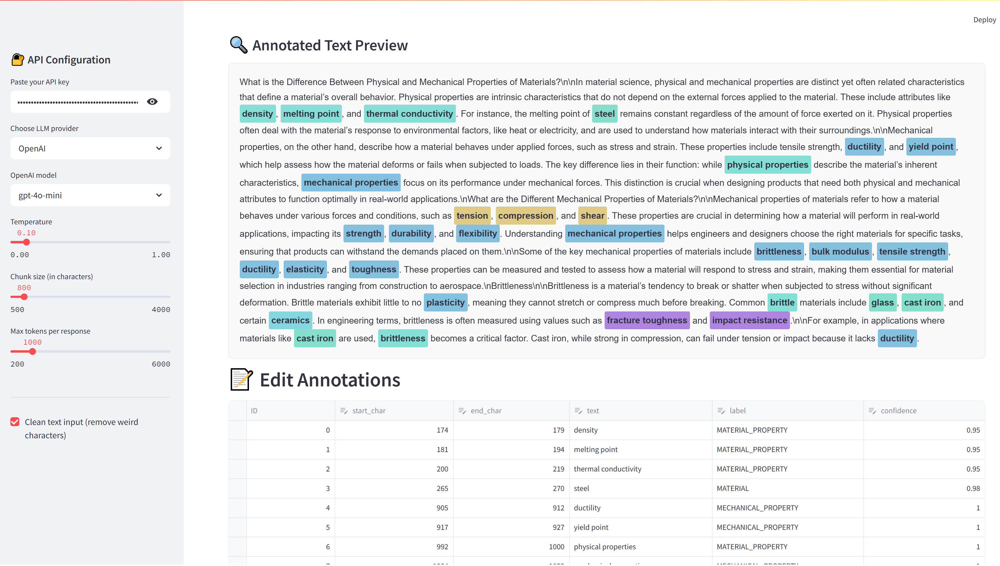

# 🔬 Scientific Text Annotator with LLMs

## This Repository does not contain all the codes. It was created from my Private Repository for public viewing purposes.

A powerful Streamlit application that uses Large Language Models (OpenAI GPT or Anthropic Claude) to automatically annotate scientific text with custom tag definitions. The app provides a complete workflow from annotation to validation, editing, and evaluation.



[Live Show](https://annotation-llm-a68350c1bd58.herokuapp.com/)

## ✨ Features

### Core Functionality

- **Multi-LLM Support**: Choose between OpenAI (GPT-3.5, GPT-4, GPT-4o) or Anthropic Claude models
- **Custom Tag Definitions**: Upload your own tag set with definitions and examples via CSV
- **Chunked Processing**: Handles large texts by breaking them into configurable chunks
- **Visual Annotation Display**: Interactive highlighting of annotated entities in the text
- **Comprehensive Export**: Download annotations with complete metadata in JSON format

### Advanced Capabilities

- **Interactive Editing**: Edit, add, or remove annotations through a built-in data editor
- **Position Validation**: Validate that annotation positions match the actual text
- **Automatic Position Fixing**: Automatically correct misaligned annotation positions
- **LLM Evaluation**: Use LLM to evaluate annotation quality and get improvement suggestions
- **Batch Recommendation Application**: Apply multiple LLM suggestions at once

## 🚀 Quick Start

### Prerequisites

- Python 3.9+
- Streamlit
- OpenAI API key or Anthropic Claude API key

### Installation

```bash
git clone <repository-url>
cd scientific-text-annotator
pip install -r requirements.txt
```

### Running the App

```bash
streamlit run app_v3_agent_optimization.py
```

## 📋 Usage Guide

### 1. Setup

1. **Configure API**: Enter your OpenAI or Claude API key in the sidebar
2. **Select Model**: Choose your preferred LLM provider and model
3. **Adjust Parameters**: Configure temperature, chunk size, and max tokens

### 2. Input Data

1. **Upload Text**:
   - Upload a `.txt` file, or
   - Paste text directly into the text area
2. **Upload Tag Set**: Upload a CSV file with columns:
   - `tag_name`: The name of the annotation tag
   - `definition`: Clear definition of what the tag represents
   - `examples`: Examples of text that should be tagged

### 3. Run Annotation

1. Click **"🔍 Run Annotation"** to start the process
2. Monitor progress as the app processes text chunks
3. View annotation statistics and distribution

### 4. Review and Edit (Optional)

1. **Visual Preview**: See highlighted annotations in the text
2. **Edit Annotations**: Use the interactive table to:
   - Modify annotation text, positions, or labels
   - Add new annotations
   - Delete unwanted annotations
3. **Validation**: Check if annotation positions match the text
4. **Auto-Fix**: Automatically correct position misalignments

### 5. LLM Evaluation (Optional)

1. **Run Evaluation**: Let the LLM assess annotation quality
2. **Review Suggestions**: See recommendations for label changes or deletions
3. **Apply Recommendations**: Selectively apply LLM suggestions

### 6. Export Results

Download your annotations in JSON format with complete metadata

## 🔧 Configuration Options

### Processing Parameters

- **Temperature** (0.0-1.0): Controls LLM creativity/consistency
- **Chunk Size** (200-4000 chars): Size of text segments processed individually
- **Max Tokens**: Maximum tokens per LLM response
- **Clean Text**: Remove non-printable characters from input

### Model Selection

**OpenAI Models:**

- `gpt-4o-mini` (recommended for cost-effectiveness)
- `gpt-4o` (best performance)
- `gpt-4`
- `gpt-3.5-turbo`

**Claude Models:**

- `claude-3-5-sonnet-20250219`
- `claude-3-5-haiku-20241022`

## 📊 Tag Set CSV Format

Your tag definition CSV must include these columns:

```csv
tag_name,definition,examples
GENE,"A DNA sequence that codes for a protein","TP53, BRCA1, insulin gene"
PROTEIN,"A biological molecule made of amino acids","hemoglobin, antibody, enzyme"
DISEASE,"A medical condition or disorder","cancer, diabetes, Alzheimer's disease"
```

## 🔍 Validation and Quality Control

### Position Validation

- Checks if annotation positions correctly correspond to the tagged text
- Identifies misaligned annotations caused by text processing
- Reports overlapping annotations and zero-length annotations

### Automatic Position Fixing

- **First Strategy**: Uses the first occurrence of the text found
- **Closest Strategy**: Chooses the position closest to the original annotation

### LLM Evaluation

- Assesses whether annotations match their tag definitions
- Provides confidence scores and detailed reasoning
- Suggests label changes or entity deletions
- Tracks which recommendations have been applied

## 📁 File Structure

```
scientific-text-annotator/
├── app_v3_agent_optimization.py    # Main Streamlit application
├── prompts_flat.py                 # LLM prompt templates
├── helper.py                       # Utility functions
├── llm_clients.py                  # LLM client implementations
├── requirements.txt                # Python dependencies
└── README.md                       # This file
```

## 🔧 Key Functions

### Core Processing

- `run_annotation_pipeline()`: Main annotation workflow
- `chunk_text()`: Splits text into processable chunks
- `aggregate_entities()`: Combines annotations from all chunks

### Validation & Fixing

- `validate_annotations_streamlit()`: Checks annotation correctness
- `fix_annotation_positions_streamlit()`: Corrects position errors

### Evaluation

- `evaluate_annotations_with_llm()`: LLM-based quality assessment
- `apply_evaluation_recommendations()`: Applies LLM suggestions

### Display

- `display_annotated_entities()`: Visual text highlighting
- `display_processing_summary()`: Shows processing statistics

## 💡 Best Practices

### For Better Annotations

1. **Clear Tag Definitions**: Write precise, unambiguous definitions
2. **Good Examples**: Provide diverse, representative examples
3. **Appropriate Chunk Size**: Balance context vs. processing time
4. **Multiple Passes**: Run evaluation and apply suggestions iteratively

### For Large Texts

1. **Optimize Chunk Size**: Larger chunks provide more context but slower processing
2. **Monitor Token Usage**: Adjust max_tokens based on chunk size
3. **Use Efficient Models**: Consider `gpt-4o-mini` for cost-effectiveness

### Quality Control

1. **Always Validate**: Check position accuracy after annotation
2. **Review LLM Suggestions**: Don't blindly apply all recommendations
3. **Manual Review**: Spot-check annotations for accuracy
4. **Iterative Improvement**: Refine tag definitions based on results

## ⚠️ Limitations

- **API Rate Limits**: Large texts may hit API rate limits
- **Context Windows**: Very long texts are processed in chunks, potentially losing global context
- **Model Dependence**: Quality depends on the chosen LLM's capabilities
- **Position Sensitivity**: Text preprocessing may affect annotation positions

## 🐛 Troubleshooting

### Common Issues

1. **"API key missing"**: Ensure you've entered a valid API key
2. **Position mismatches**: Run validation and use the auto-fix feature
3. **Empty annotations**: Check your tag definitions and examples
4. **Memory issues**: Reduce chunk size or max tokens for large texts

### Performance Tips

- Use smaller chunk sizes for faster processing
- Choose appropriate models based on your accuracy/cost requirements
- Clean text input to avoid processing issues

## 📞 Support

[Email](amirhossein.bayani@gmail.com)

---

**Happy Annotating! 🎉**
