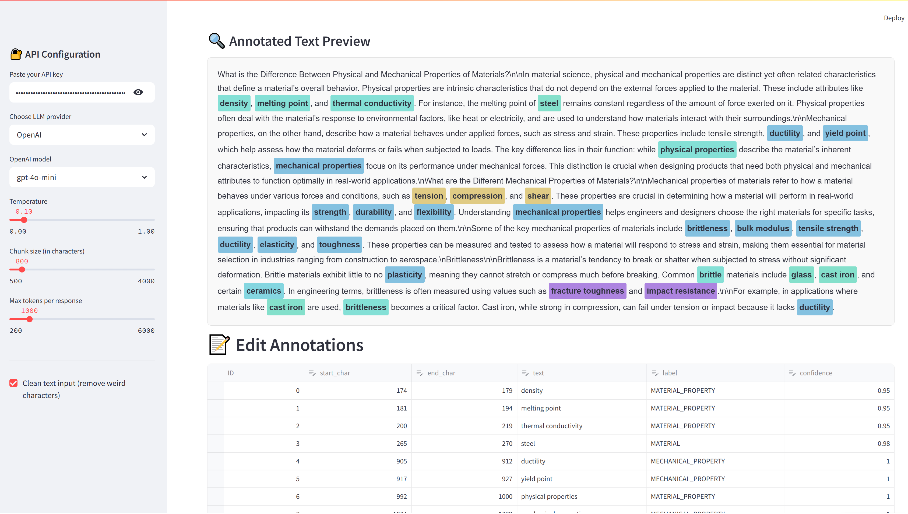

# 🔬 Scientific Text Annotator with LLMs

A powerful Streamlit application that uses Large Language Models (OpenAI GPT or Claude) to automatically annotate scientific text with custom tags and definitions. Perfect for researchers, data scientists, and anyone working with scientific literature who needs automated text annotation capabilities.



## ✨ Features

### 🤖 **Multi-Model Support**
- **OpenAI Models**: GPT-4o, GPT-4o-mini, GPT-4, GPT-3.5-turbo
- **Anthropic Claude**: Claude-3-opus, Claude-3-sonnet, Claude-3-haiku

### 📝 **Flexible Input Methods**
- Upload `.txt` files directly
- Paste text into the interface
- Automatic text cleaning (removes non-printable characters)

### 🏷️ **Custom Tag System**
- Define your own annotation tags via CSV upload
- Required columns: `tag_name`, `definition`, `examples`
- Automatic color generation for visual distinction

### 🔧 **Advanced Processing Options**
- **Chunking**: Handles large texts by splitting into manageable chunks
- **Temperature Control**: Adjust model creativity (0.0-1.0)
- **Token Limits**: Configure max tokens per API response
- **Smart Text Splitting**: Preserves word boundaries when chunking

### 📊 **Real-time Progress Tracking**
- Live progress bars during processing
- Chunk-by-chunk status updates
- Time estimates and elapsed time display
- Detailed processing summaries

### 🎨 **Rich Visualization**
- Color-coded annotations with hover tooltips
- Interactive highlighted text display
- Clean, professional styling

### ✏️ **Post-Processing Editing**
- Edit annotations in an interactive table
- Add or remove annotations manually
- Bulk deletion with multi-select
- Real-time updates to highlighted text

### 💾 **Export Capabilities**
- Download results as structured JSON
- Includes original text and all annotations
- Preserves character positions and labels

## 🚀 Installation

### Prerequisites
- Python 3.7+
- Streamlit
- pandas
- Valid API key for OpenAI or Anthropic

### Required Files
The application requires these additional files to function:
- `prompts_flat.py` - Contains the `build_annotation_prompt()` function
- `llm_clients.py` - Contains the `LLMClient` class for API interactions

### Setup
1. Install required packages:
```bash
pip install streamlit pandas
```

2. Ensure you have your additional Python modules:
   - `prompts_flat.py`
   - `llm_clients.py`

3. Run the application:
```bash
streamlit run app.py
```

## 📋 Usage Guide

### Step 1: Configure API Access
1. **Enter API Key**: Paste your OpenAI or Anthropic API key in the sidebar
2. **Select Provider**: Choose between OpenAI or Claude
3. **Choose Model**: Select the specific model variant
4. **Adjust Parameters**:
   - **Temperature**: Control randomness (0.0 = deterministic, 1.0 = creative)
   - **Chunk Size**: Characters per processing chunk (500-4000)
   - **Max Tokens**: Maximum tokens per API response (200-6000)

### Step 2: Upload Your Text
- **Option A**: Upload a `.txt` file using the file uploader
- **Option B**: Paste text directly into the text area
- **Text Cleaning**: Enable automatic removal of non-printable characters

### Step 3: Define Your Tags
Create a CSV file with these required columns:
- `tag_name`: The label for this annotation type
- `definition`: Clear definition of what this tag represents
- `examples`: Example text that should receive this tag

**Example CSV:**
```csv
tag_name,definition,examples
GENE,Names of genes or genetic sequences,TP53; BRCA1; insulin gene
PROTEIN,Protein names and enzyme references,hemoglobin; cytochrome c; DNA polymerase
DISEASE,Medical conditions and pathologies,cancer; diabetes; Alzheimer's disease
```

### Step 4: Review Processing Summary
Before running annotation, review the automatically generated summary:
- Text statistics (length, estimated tokens)
- Chunking information (number of chunks, size)
- Model configuration
- Detailed chunk breakdown

### Step 5: Run Annotation
1. Click **"🔍 Run Annotation"**
2. Monitor real-time progress with:
   - Progress bars
   - Chunk-by-chunk updates
   - Time estimates
   - Live status messages

### Step 6: Review and Edit Results
- **Visual Preview**: See your text with color-coded annotations
- **Interactive Editing**: Modify annotations in the data table
- **Bulk Operations**: Select and delete multiple annotations
- **Real-time Updates**: Changes reflect immediately in the preview

### Step 7: Export Results
Download your annotations as a structured JSON file containing:
- Original text
- All annotations with positions and labels
- Metadata for further processing

## 🔧 Technical Details

### Text Processing
- **Smart Chunking**: Attempts to split on newlines or spaces to preserve word boundaries
- **Offset Tracking**: Maintains accurate character positions across chunks
- **Overlap Handling**: Prevents duplicate annotations in overlapping regions

### API Integration
- **Error Handling**: Robust error handling for API failures
- **Rate Limiting**: Processes chunks sequentially to respect API limits
- **Response Parsing**: Intelligent JSON extraction from LLM responses

### Data Structure
Annotations are stored as JSON objects with this structure:
```json
{
  "text": "Original text content",
  "entities": [
    {
      "start_char": 0,
      "end_char": 10,
      "text": "gene name",
      "label": "GENE"
    }
  ]
}
```

## 📊 Performance Considerations

### Chunking Strategy
- **Default**: 800 characters per chunk
- **Recommendation**: Adjust based on your model's context window
- **Trade-off**: Larger chunks provide better context but may hit token limits

### Token Estimation
- **Rule of Thumb**: ~4 characters per token for English text
- **Monitoring**: Built-in token estimation helps predict costs
- **Optimization**: Adjust chunk size and max tokens based on your needs

### Cost Management
- **Progress Tracking**: Monitor API calls in real-time
- **Chunk Preview**: Review what will be processed before starting
- **Model Selection**: Choose appropriate model for your accuracy/cost balance

## 🎯 Best Practices

### Tag Definition
1. **Be Specific**: Provide clear, unambiguous definitions
2. **Include Examples**: Add 3-5 representative examples per tag
3. **Avoid Overlap**: Ensure tag definitions don't conflict
4. **Test Small**: Start with a small text sample to validate tags

### Text Preparation
1. **Clean Data**: Use the built-in text cleaning option
2. **Structure**: Well-formatted text produces better results
3. **Length**: Consider your API limits when processing very long texts
4. **Encoding**: Ensure proper UTF-8 encoding for special characters

### Model Selection
- **GPT-4o**: Best accuracy, higher cost
- **GPT-4o-mini**: Good balance of speed and accuracy
- **Claude-3-opus**: Excellent for complex scientific text
- **Claude-3-haiku**: Fast and cost-effective for simple annotations

## 🛠️ Troubleshooting

### Common Issues

**"API key missing"**
- Ensure your API key is properly pasted in the sidebar
- Verify the key is valid and has sufficient credits

**"Failed to parse LLM output JSON"**
- The model may be returning malformed JSON
- Try adjusting temperature (lower = more consistent)
- Check if your tag definitions are clear enough

**"Chunk processing failed"**
- Reduce chunk size if hitting token limits
- Increase max tokens if responses are cut off
- Check API rate limits

**"No annotations found"**
- Verify your text contains examples of your defined tags
- Review tag definitions for clarity
- Try a different model or adjust temperature

### Performance Issues
- **Slow Processing**: Reduce chunk size or choose a faster model
- **High Costs**: Use smaller models or reduce max tokens
- **Memory Issues**: Process shorter texts or restart the application

## 📜 License

This project is provided as-is for educational and research purposes. Please ensure compliance with your chosen LLM provider's terms of service.

## 🤝 Contributing

This is a research tool designed for scientific text annotation. Contributions and improvements are welcome!

## 📞 Support

For issues related to:
- **OpenAI API**: Check OpenAI's documentation and status page
- **Claude API**: Refer to Anthropic's API documentation
- **Streamlit**: Consult Streamlit's community forums

---

**Happy Annotating! 🎉**